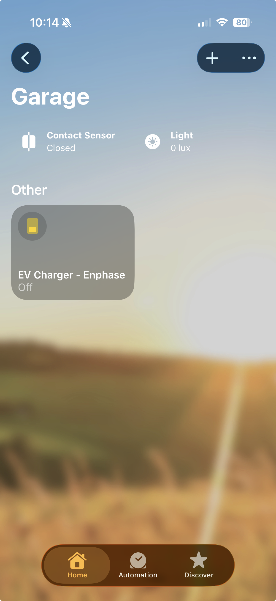

# Homebridge Enphase EV Charger

This is a focused Homebridge plugin workspace for the Enphase IQ EV charger. It is intentionally much smaller than `homebridge-enphase-envoy` and is aimed at just a few charger-specific features:

- charger on/off control
- current charger state, including estimated live power in watts
- optional charging-status sensor in Apple Home
- optional estimated charging-power sensor in Apple Home using a light sensor with lux as a watt proxy

## Apple Home

The plugin can expose the charger switch plus optional Apple Home sensors for charging status and estimated charging power.



## Current state

Current test milestone: `v0.4.2`

This workspace is now partly wired to the real Enlighten homeowner web app.

What is already wired in:

- Homebridge platform plugin structure
- Enphase credential-based login through Enlighten
- a charger control accessory exposed as a `Switch`
- optional `Contact Sensor` named `EV Charging Status`
- optional `Light Sensor` named `Estimated EV Charging Power`
- custom read-only characteristics for charging power and charger session state
- a polling loop for charger status
- real browser-session control using the same Enphase web endpoints the Live Status page uses
- estimated live charging power using the site-load livestream minus a pre-charge baseline

What still needs refinement:

- ongoing real-world tuning for the estimated power proxy

## Acknowledgment

This charger-focused plugin started in the orbit of the broader Enphase Homebridge ecosystem, especially `homebridge-enphase-envoy`, because that plugin helped confirm the homeowner-authentication side of the Enphase environment. But the current charger implementation was effectively rebuilt around Enlighten web-session control, charger autodiscovery, and livestream analysis, so it is now largely a separate code path rather than a light modification of the older solar-and-battery plugin.

## Why this plugin exists

Your Envoy local API does not expose the charger as an `evse` meter on this system. The existing `homebridge-enphase-envoy` plugin authenticates correctly, but it only sees:

- `production`
- `net-consumption`
- `total-consumption`

That makes a charger-only plugin a better fit than extending the larger solar-and-battery plugin.

## Suggested config

The intended easy path is now:

- `systemId`
- `enlightenUser`
- `enlightenPasswd`

In `enlighten-web` mode, the plugin can discover:

- `chargerSerial`
- `gatewaySerial`
- charger model
- charger firmware
- charger SKU
- charger part number
- charger rated current / charge-level ceiling

```json
{
  "platform": "EnphaseEvCharger",
  "name": "Enphase EV Charger",
  "systemId": "705286",
  "gatewayHost": "192.168.0.205",
  "enlightenUser": "your-email@example.com",
  "enlightenPasswd": "your-password",
  "exposeChargingStatusSensor": true,
  "exposeChargingPowerSensor": false,
  "idlePollIntervalSeconds": 300,
  "pluggedInPollIntervalSeconds": 60,
  "chargingPollIntervalSeconds": 30,
  "chargingLevel": 48,
  "connectorId": 1
}
```

In `enlighten-web` mode:

- `systemId` is still required
- `chargerSerial` and `gatewaySerial` are optional and auto-discovered
- the exact charger variant is taken from Enphase summary data, not a hardcoded model table
- `On` starts charging via `POST /service/evse_controller/{systemId}/ev_chargers/{chargerSerial}/start_charging`
- `Off` stops charging via `PUT /service/evse_controller/{systemId}/ev_chargers/{chargerSerial}/stop_charging`
- state polling uses `GET /service/evse_controller/{systemId}/ev_chargers/status`
- current status includes plugged-in and charging state
- state polling is adaptive: slow while idle, moderate while plugged in, and faster while actively charging
- estimated live charging power is derived from the site-load livestream and a pre-charge baseline
- `chargingLevel` is automatically clamped to the charger's discovered maximum if your config exceeds it
- Apple Home always gets:
  - a `Switch` for control
- Apple Home optionally gets:
  - a `Contact Sensor` named `EV Charging Status`
  - a `Light Sensor` named `Estimated EV Charging Power`
- the contact sensor is `open` while the car is actively charging and `closed` while it is not charging
- the power sensor reports lux equal to watts, so `3800 lux` means about `3800 W`

Adaptive polling defaults:

- idle / unplugged: every `300` seconds
- plugged in but not charging: every `60` seconds
- actively charging: every `30` seconds
- after Apple Home start/stop commands: short burst refreshes at `5`, `15`, `30`, and `60` seconds

The older `pollIntervalSeconds` setting is still accepted as a fallback for the charging poll interval, but new installs should prefer the three state-specific polling settings.

HomeKit accessory details:

- Manufacturer defaults to `Enphase`
- Serial Number is auto-filled from the discovered charger serial
- Model is auto-filled from the EV charger summary when available
- Firmware is auto-filled from the EV charger summary when available
- internally the plugin also keeps the discovered SKU, part number, and rated current so it can behave correctly across charger variants
- manual values can still be supplied in config if you want to override them

## Live Power Notes

The site livestream is now decoded well enough to produce a practical estimated charger-power reading:

- the plugin captures a site-load baseline before charging starts
- while charging, it estimates charger power as `current site load - baseline`
- this works well as an Apple Home automation proxy, but it is still an estimate
- it should not be expected to exactly match the lower EV-only `Consuming` number shown in the Enphase UI

What the Safari HARs proved:

- control works through `https://enlighten.enphaseenergy.com/service/evse_controller/...`
- status works through `https://enlighten.enphaseenergy.com/service/evse_controller/705286/ev_chargers/status`
- a lighter status endpoint also exists at `https://enlighten.enphaseenergy.com/service/evse_controller/api/v2/705286/ev_chargers/status`
- the general site livestream provides the load data needed for the estimate
